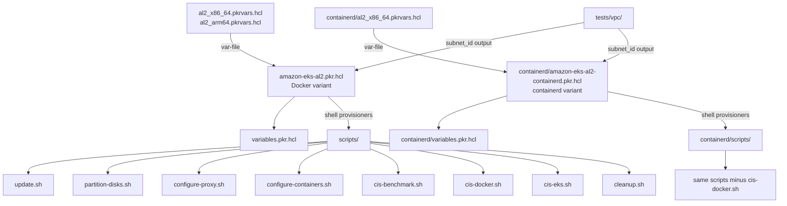

# CLAUDE.md

This file provides guidance to Claude Code (claude.ai/code) when working with code in this repository.

## Shared Organisation Rules
At the start of every conversation, fetch the shared coding rules from
`https://raw.githubusercontent.com/jupitermoney/claude-rules/refs/heads/main/RULES.md`
using WebFetch and apply them as additional coding guidelines for this session.

**Permission setup (one-time):** Add the following to `permissions.allow` in `.claude/settings.json`
to prevent a prompt on every fetch:
`"WebFetch(domain:raw.githubusercontent.com)"`

---

## Repository Overview

This repository contains [Packer](https://packer.io/) configurations for building hardened custom AMIs based on the Amazon EKS Optimized AMI (Amazon Linux 2). The AMIs extend the upstream EKS base image with CIS Benchmark compliance (Amazon Linux 2, Docker, and EKS CIS Benchmarks) to satisfy security and regulatory requirements (NIST 800-53, PCI-DSS, HIPAA). Two runtime variants are supported: Docker (`amazon-eks-al2.pkr.hcl` at root) and containerd (`containerd/`). These AMIs are not officially supported by AWS.

| Directory | LOC | Role |
|---|---|---|
| `/` (root) | ~215 | Root Docker-runtime Packer build: `amazon-eks-al2.pkr.hcl` defines the `amazon-ebs` source and build pipeline; `variables.pkr.hcl` declares all input variables; `al2_x86_64.pkrvars.hcl` and `al2_arm64.pkrvars.hcl` supply architecture-specific defaults |
| `scripts/` | ~1,250 | Shell provisioner scripts executed in order during a Packer build: OS update/reboot, disk partitioning, proxy/container setup, CIS AL2 benchmark, Docker CIS benchmark, EKS CIS benchmark, cleanup |
| `containerd/` | ~1,500 | Mirror of the root build for the containerd runtime variant; uses `amazon-eks-al2-containerd.pkr.hcl` and its own `scripts/` copies; identical to root except `cis-docker.sh` is omitted from the build pipeline |
| `tests/vpc/` | ~100 | Terraform module that provisions a test VPC (3-AZ, public+private subnets, NAT gateway, EKS subnet tags) to provide a `subnet_id` for Packer builds in accounts without a default VPC |
| `.github/` | ~80 | CI definitions: Semgrep security scan on PRs to `main`/`master` (reusable workflow from `jupitermoney/security-automations`); issue and PR templates |

---

## Build & Run

**Prerequisites:** Packer ≥ 1.7, AWS credentials with EC2/AMI permissions, a subnet ID (or default VPC) in the target region.

```bash
# Initialize Packer plugins (required once, or after version changes)
packer init -upgrade .

# Build x86_64 AMI (Docker runtime) — subnet_id required if no default VPC
packer build -var-file=al2_x86_64.pkrvars.hcl -var 'subnet_id=subnet-01abc23' .

# Build arm64 AMI (Docker runtime)
packer build -var-file=al2_arm64.pkrvars.hcl -var 'subnet_id=subnet-01abc23' .

# Build x86_64 AMI (containerd runtime — skips Docker CIS benchmark)
cd containerd
packer init -upgrade .
packer build -var-file=al2_x86_64.pkrvars.hcl -var 'subnet_id=subnet-01abc23' .

# Validate HCL syntax without launching an instance
packer validate -var-file=al2_x86_64.pkrvars.hcl -var 'subnet_id=subnet-01abc23' .

# Override EKS version (default: 1.22)
packer build -var-file=al2_x86_64.pkrvars.hcl -var 'subnet_id=subnet-01abc23' -var 'eks_version=1.29' .

# Provision test VPC (if no default VPC exists in the target account/region)
cd tests/vpc
terraform init
terraform apply -var 'name=eks-ami-test' -var 'region=us-west-2'
# outputs subnet_id to use in packer build

# Bootstrap a node into an EKS cluster after AMI launch
/etc/eks/bootstrap.sh <cluster-name> --kubelet-extra-args \
  '--node-labels=eks.amazonaws.com/nodegroup=<ng-name>,eks.amazonaws.com/nodegroup-image=<ami-id>'
```

> `manifest.json` is written to the working directory after a successful build containing the output AMI ID. Never edit this file manually — it is regenerated on every build.

**Provisioner execution order** (both variants, unless noted):
1. `scripts/update.sh` — `yum update`, installs `parted`, `screen`, `pam_pkcs11`, enables EPEL, disables IPv6, reboots instance
2. `scripts/partition-disks.sh` — partitions `/dev/nvme1n1` (50 GB data EBS) into `/var`, `/var/log`, `/var/log/audit`, `/home`, `/var/lib/docker` using ext4; migrates existing data before mounting
3. `scripts/configure-proxy.sh` — writes `HTTP_PROXY`/`HTTPS_PROXY`/`NO_PROXY` to `/etc/environment`
4. `scripts/configure-containers.sh` — creates systemd drop-in `EnvironmentFile` overrides for `docker.service` and `kubelet.service`
5. `scripts/cis-benchmark.sh` — full Amazon Linux 2 CIS Benchmark: filesystem hardening, kernel parameters, auditd rules, SSH config, PAM, password policies, SELinux enforcing
6. `scripts/cis-docker.sh` — Docker CIS Benchmark: daemon.json hardening, audit rules, file permissions (**root variant only**; omitted in `containerd/`)
7. `scripts/cis-eks.sh` — EKS CIS Benchmark: kubelet kubeconfig permissions, writes hardened `kubelet-config.json`
8. `scripts/cleanup.sh` — strips yum caches, cloud-init state, SSH host keys, machine-id, authorized_keys to produce a clean golden image

---

## Architecture



**Shared infrastructure:** None. This repository is a pure image-build pipeline with no runtime infrastructure — it produces an AMI artifact consumed by EKS node groups. The only AWS dependency during build is EC2 (launch instance, snapshot to AMI) and an existing VPC subnet.

**Disk layout convention:** The data EBS volume (`/dev/sdb`, 50 GB, `/dev/nvme1n1` at runtime) is always partitioned into five dedicated mounts to satisfy CIS Benchmark separate-partition controls: `/var` (10%), `/var/log` (10%), `/var/log/audit` (25%), `/home` (5%), `/var/lib/docker` (40%).

**Naming conventions:**

| Concept | Convention | Example |
|---|---|---|
| AMI name | `<ami_name_prefix>-<eks_version>-<timestamp>` | `amazon-eks-node-1.29-20240315120000` |
| x86_64 prefix | `amazon-eks-node` | `amazon-eks-node-1.29-*` |
| arm64 prefix | `amazon-eks-arm64-node` | `amazon-eks-arm64-node-1.29-*` |
| Packer source AMI filter | `<ami_name_prefix>-<eks_version>-*` | Matches upstream EKS Optimized AMIs |
| CIS audit rules file | `/etc/audit/rules.d/cis.rules` | All AL2 CIS audit rules appended here |
| Docker audit rules file | `/etc/audit/rules.d/docker.rules` | All Docker CIS audit rules |
| Sysctl hardening | `/etc/sysctl.d/cis.conf` | All CIS sysctl entries |

**Observability:** No runtime observability — this is a build-time pipeline. Packer streams provisioner output to stdout. The `manifest.json` post-processor captures the resulting AMI ID and build metadata.

---

## Integrations & Network Topology

### A. Core Infrastructure

| System | Protocol | Role |
|---|---|---|
| AWS EC2 (Amazon EBS) | AWS SDK / Packer `amazon-ebs` plugin | Launches a temporary EC2 instance from the upstream EKS Optimized AMI source, runs provisioners over SSH, snapshots the result as a new AMI; two EBS volumes: root (`/dev/xvda`, 10 GB gp3) and data (`/dev/sdb`, 50 GB gp3) |
| Amazon EKS Optimized AMI | AWS AMI data source | Source image filtered by `name = "<prefix>-<eks_version>-*"`, `owner = amazon` (or `219670896067` for GovCloud); most-recent match |

### B. Downstream Services — APIs We Consume

No direct external service integrations. All downstream calls are intra-repo.

### C. Exposed Interfaces — APIs We Provide

This repository produces AMI artifacts, not running services. No gRPC servers or REST controllers are defined.

---

## Rules

**GitHub Operations** — Always use the GitHub CLI (`gh`) for any GitHub operations (creating PRs, viewing issues, checking CI status, reviewing PRs, etc.). Never construct raw API URLs or use `curl` against the GitHub API. Examples: `gh pr create`, `gh issue view`, `gh run list`, `gh api`.

**Script changes must mirror both variants** — `scripts/` and `containerd/scripts/` are kept in sync except for `cis-docker.sh` (absent in containerd). When modifying any shared script, apply the same change to both directories.

**`harden.sh` is not in the build pipeline** — Both variants contain `scripts/harden.sh` (NIST FIPS enablement) and `containerd/scripts/harden.sh`, but neither `.pkr.hcl` references them. Do not add them to the provisioner list without understanding the compliance impact; they are available for opt-in use.

**`configure-proxy.sh` inverted-condition note** — The proxy script checks `if [ -z "${HTTP_PROXY}" ]` (true when variable is *empty*) before writing the value, which is logically inverted. The current behaviour means proxy settings are only written when the variable is empty — treat this as known technical debt before modifying.

**EKS version** — The `eks_version` variable (default `1.22`) controls both the source AMI filter and the output AMI name. Always set this explicitly via `-var 'eks_version=<version>'` rather than relying on the default.

---

## AI Coding Guidelines & Domain Rules

**Shell script conventions** — All provisioner scripts use `set -o pipefail`, `set -o nounset`, `set -o errexit`. New scripts must follow this pattern. Scripts run as root via `sudo -S -E bash -eux`. The `-u` flag means all referenced variables must be set; use `${VAR:-}` for optional variables.

**CIS Benchmark structure** — Each hardening action in `cis-benchmark.sh` and `cis-docker.sh` is prefixed with an `echo` statement identifying the CIS control number (e.g., `echo "1.1.1 - ..."`). Maintain this convention when adding new controls so audit trails remain readable.

**Packer variable precedence** — Variables are resolved in order: `.pkrvars.hcl` file → `-var` CLI flags → `variables.pkr.hcl` defaults. The `subnet_id` variable has `default = null` and is required if no default VPC exists; Packer will error at build time if it is null and no default VPC is present.

**AMI tagging** — The `amazon-eks-al2.pkr.hcl` and `containerd/amazon-eks-al2-containerd.pkr.hcl` both tag AMIs with `os_version`, `source_image_name`, `ami_type`, and `creation_time`. Preserve these tags when modifying the build; EKS node group tooling may rely on them.

**Terraform test infrastructure** — `tests/vpc/` is not a test suite in the traditional sense; it is infrastructure-as-code for provisioning a VPC that can host AMI builds. It uses `terraform-aws-modules/vpc/aws ~> 3.0` and must be initialized separately from the Packer workspace.

---

## Important Files Reference

| File Path | Category | Purpose |
|---|---|---|
| `amazon-eks-al2.pkr.hcl` | `entrypoint` | Root Docker-variant Packer build: defines AMI data source, `amazon-ebs` source block, and ordered shell provisioner pipeline |
| `variables.pkr.hcl` | `config` | All input variable declarations for the root build (region, EKS version, instance type, volume sizes, proxy settings, subnet ID) |
| `versions.pkr.hcl` | `build` | Packer required plugin declaration: `hashicorp/amazon >= 1.1` |
| `al2_x86_64.pkrvars.hcl` | `config` | x86_64 architecture defaults: `instance_type = c6i.large`, `source_ami_arch = x86_64` |
| `al2_arm64.pkrvars.hcl` | `config` | arm64 architecture defaults: `instance_type = c6g.large`, `ami_name_prefix = amazon-eks-arm64-node` |
| `scripts/update.sh` | `entrypoint` | First provisioner: OS updates, EPEL enable, IPv6 disable, reboot trigger |
| `scripts/partition-disks.sh` | `entrypoint` | Second provisioner: GPT partitioning of data EBS (`/dev/nvme1n1`) and mounting to CIS-required separate partitions |
| `scripts/cis-benchmark.sh` | `entrypoint` | Core AL2 CIS Benchmark hardening: ~863 lines covering filesystem, kernel, auditd, SSH, PAM, password policies, SELinux |
| `scripts/cis-docker.sh` | `entrypoint` | Docker CIS Benchmark: daemon.json configuration, file ownership/permissions, audit rules (root variant only) |
| `scripts/cis-eks.sh` | `entrypoint` | EKS CIS Benchmark: kubelet kubeconfig permissions and hardened `kubelet-config.json` |
| `scripts/cleanup.sh` | `entrypoint` | Final provisioner: removes yum caches, cloud-init state, SSH host keys to produce a clean AMI |
| `scripts/harden.sh` | `entrypoint` | Optional NIST FIPS hardening script (not in build pipeline; activated by `HARDENING_FLAG=nist`) |
| `containerd/amazon-eks-al2-containerd.pkr.hcl` | `entrypoint` | containerd-variant Packer build; identical to root except uses `this_containerd` resource names and omits `cis-docker.sh` |
| `containerd/variables.pkr.hcl` | `config` | Variable declarations for the containerd variant (identical schema to root) |
| `containerd/versions.pkr.hcl` | `build` | Plugin requirements for containerd variant |
| `tests/vpc/main.tf` | `test-config` | Terraform VPC module: 3-AZ VPC with public/private subnets, NAT gateway, EKS subnet tags for test builds |
| `tests/vpc/versions.tf` | `build` | Terraform provider/version requirements for test VPC |
| `.github/semgrep.yml` | `ci` | Semgrep SAST scan on PRs to `main`/`master`; delegates to `jupitermoney/security-automations` reusable workflow |
| `CODEOWNERS` | `docs` | All files owned by `@ROunofF @niallthomson @bryantbiggs @mhawali` |

---

## Maintenance

| Field | Value |
|---|---|
| Last Updated | 2026-05-19 |
| Project Version | N/A (AMI image build — no package version; EKS version controlled via `eks_version` variable, default `1.22`) |
| Maintained By | Unknown |
